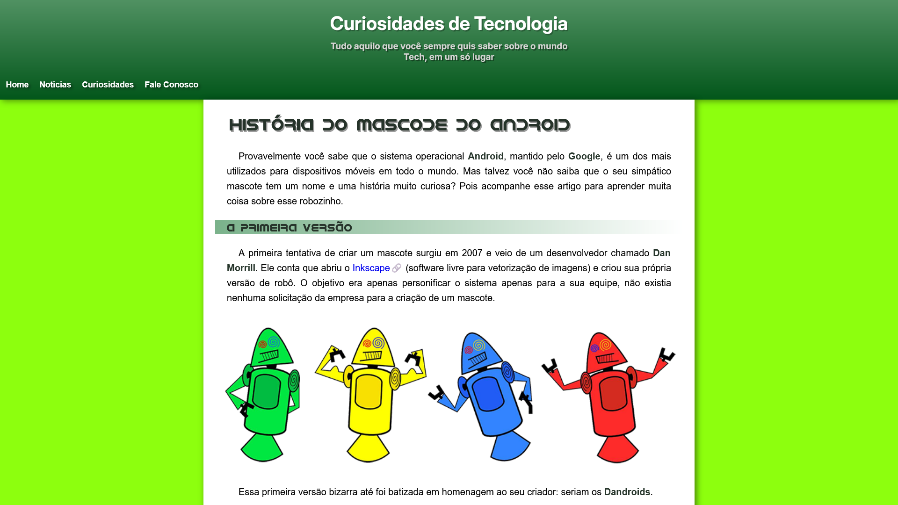

# Mini Projeto Android: A História do Mascote

[🇺🇸 English](./README.md) | [🇧🇷 Português](./README.pt.md)


---


Uma página web responsiva que conta a curiosa história do mascote do sistema operacional Android, o Bugdroid. Este projeto foi desenvolvido como um caso de estudo para HTML5 e CSS3, com foco em estrutura semântica, design responsivo e recursos modernos de CSS.


---
### 📋 Índice

- [Visão Geral do Projeto](#-visão-geral-do-projeto)
- [Destaques e Funcionalidades](#-destaques-e-funcionalidades)
- [Tecnologias Utilizadas](#-tecnologias-utilizadas)
- [Pré-requisitos](#-pré-requisitos)
- [Instalação](#-instalação)
- [Como Usar](#-como-usar)
- [Contribuição](#-contribuição)
- [Licença](#-licença)
- [Autor](#-autor)
---


## 🚀 Visão Geral do Projeto



Este projeto é um site de página única criado para apresentar a história do mascote do Android. Ele aborda a origem dos primeiros conceitos de mascote, a criação do famoso Bugdroid por Irina Blok e curiosidades sobre os nomes das versões do Android. O layout foi projetado para ser agradável e legível tanto em dispositivos desktop quanto móveis.


## ✨ Destaques e Funcionalidades

- **Design Responsivo:** O layout se adapta a diferentes tamanhos de tela usando media queries e unidades flexíveis.
- **HTML Semântico:** O código é estruturado com tags semânticas do HTML5 como `<header>`, `<main>`, `<article>`, `<section>`, `<aside>` e `<footer>` para melhor acessibilidade e SEO.
- **Fontes Personalizadas:** Usa `@font-face` para carregar uma fonte personalizada para os títulos.
- **Mídia Incorporada:** Inclui um vídeo do YouTube responsivo e incorporado.
- **CSS Avançado:** Apresenta gradientes, sombras de caixa (box-shadows), pseudo-elementos e transições para uma melhor experiência do usuário.

## 🛠️ Tecnologias Utilizadas

Este projeto foi construído usando as seguintes tecnologias:


## ⚙️ Pré-requisitos

Tudo o que você precisa é de um navegador web moderno para visualizar o projeto.


## 📦 Instalação

```bash
# 1. Clone este repositório
$ git clone https://github.com/emellybmuniz/mini-projeto-android.git
# 2. Navegue até o diretório do projeto
$ cd mini-projeto-android
# 3. Abra no seu navegador
$ open index.html  # Ou dê um duplo clique no arquivo
```

--  ---
## 💡 Como Usar

1.. **Leia o artigo:** Role a página para ler a história completa do mascote do Android, desde suas origens até o design final.
3. **Assista ao vídeo:** Clique no player de vídeo incorporado para assistir a um conteúdo relacionado sobre a história do Android.
4. **Explore os links externos:** Clique nos links destacados no texto para visitar sites externos, como a página oficial do Inkscape ou o histórico de versões do Android.
5. **Confira a lista de versões:** Na seção "Quer aprender mais?", você encontrará uma lista das versões do Android que foram nomeadas em homenagem a doces.


## 🤝 Contribuição

Contribuições são sempre bem-vindas e muito apreciadas! Sinta-se à vontade para abrir uma questão ou enviar uma solicitação de pull.

1. Faça um *fork* do projeto.
2. Crie uma nova *branch* (`git checkout -b feature/sua-feature`).
3. Faça o *commit* de suas alterações (`git commit -m 'Adiciona nova feature'`).
4. Faça o *push* para a *branch* (`git push origin feature/sua-feature`).
5. Abra um *Pull Request*.


## 🔑 Licença

Este projeto está licenciado sob a Licença MIT - veja o arquivo LICENSE.md para mais detalhe


## ✍️ Autor

Feito por **Emelly Beatriz** com ❤️
📬 Entre em contato::
📧 emellybmuniz@gmail.com |
💼 [Linkedin](www.linkedin.com/in/emellybmuniz) |
🐙 [Github](https://github.com/emellybmuniz)
